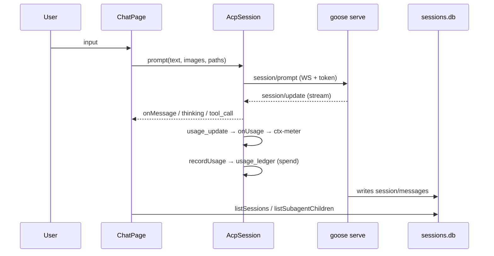
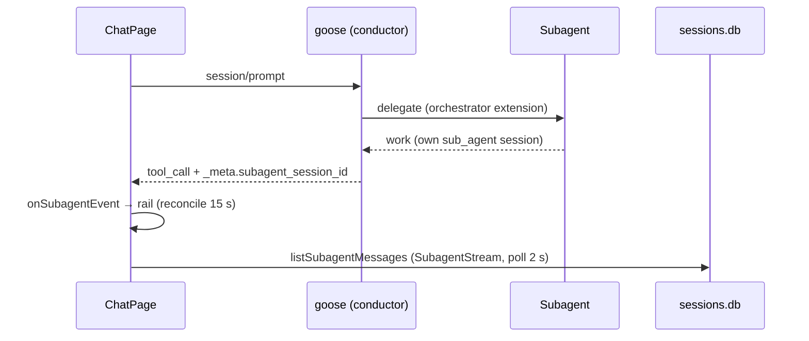
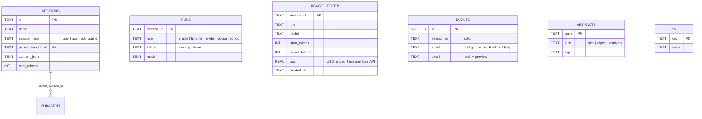

# Mayak Architecture (EN)

> Full generated graph map (mermaid, Infigraph): [architecture.md](architecture.md) (Russian) — this document mirrors it in English and adds textual descriptions of the layers, flows and subsystems: state machine, guard, watchdog, logging.
> See also: [README.en.md](README.en.md) · [development.en.md](development.en.md) · [../AGENTS.md](../AGENTS.md) (repo rules, Russian).

**Русская версия:** [architecture.ru.md](architecture.ru.md)

---

## 1. Three layers

```mermaid
graph TB
    subgraph L0["L0 — Personalities (config-only)"]
        ORACLE["oracle.md + oracle-consult.yaml"]
        LIBRARIAN["librarian.md + librarian-research.yaml"]
        METIS["pantheon-metis.md + metis-critique.yaml"]
        CONDUCTOR["pantheon-conductor.md<br/>(conductor prompt)"]
    end
    subgraph L1["L1 — Control plugin"]
        HOOKS["hooks.json<br/>SessionStart / PreToolUse /<br/>UserPromptSubmit / PostToolUse / SessionEnd"]
        GUARD["guard-rs (pantheon-guard)<br/>read-only enforcement"]
        ESC["escalate.sh<br/>[ESCALATION:LEVEL]"]
        LOG["pantheon-log.sh<br/>runs / events / audit"]
        MCP["pantheon_state.py<br/>7 MCP tools"]
    end
    subgraph L2["L2 — UI (mayak-ui, GPUIX)"]
        APP["App.tsx → Chat / Sidebar / Settings /<br/>PantheonPanel / SubagentStream …"]
        ACP["acp.ts<br/>AcpSession: state machine,<br/>permission policy, watchdog"]
        GSRV["api/gooseServer.ts<br/>spawn goose serve"]
    end
    subgraph EXT["External"]
        GOOSE["goose serve (sidecar,<br/>ACP / WebSocket)"]
    end
    subgraph DATA[("Data")]
        SDB[("sessions.db")]
        PDB[("pantheon.db<br/>runs/artifacts/kv/events/<br/>usage_ledger/handoffs")]
        TOML["pantheon.toml"]
        CFG["config.yaml"]
        ART[".pantheon/*.md"]
    end

    APP --> ACP --> GOOSE
    ACP --> GSRV
    GOOSE --> SDB
    L0 -->|delegate| GOOSE
    HOOKS --> GUARD --> PDB
    HOOKS --> ESC
    HOOKS --> LOG --> PDB
    MCP --> PDB
    GOOSE --> CFG
    APP --> PDB
    APP --> TOML
    GOOSE --> ART
```

| Layer | Contents | Change type |
|---|---|---|
| **L0 — Personalities** | `agents/*.md` (oracle, librarian, metis, conductor) + `recipes/*.yaml` (model chains, max_turns 1000) | config-only |
| **L1 — Plugin** | `plugin/hooks/hooks.json`, `plugin/guard-rs/` (Rust), `plugin/scripts/` (bash), `plugin/mcp/pantheon_state.py` | Rust / bash / Python |
| **L2 — UI** | `ui/mayak-ui/` — GPUIX (React 19 over GPUI, no webview), Bun runtime, API layer on `bun:sqlite`/`node:fs` | TypeScript / TSX |

The legacy client `ui/pantheon-ui-tauri-legacy/` is an **archive** and does not participate in the architecture.

---

## 2. Data flows

### 2.1 Main chat



1. The UI spawns the sidecar: `gooseServer.start()` → `goose serve --allowed-origin … --enable-scheduler`, secret in the query `token`, readiness `/status` (25 s), stderr → `goose-serve.log`.
2. `AcpSession.start()` → ACP `initialize` → `session/new` (cwd, mcpServers) → ready → streaming.
3. goose replies with `session/update`: `agent_message_chunk`, `agent_thought_chunk`, `tool_call`/`tool_call_update`, `usage_update`, `plan`… (handled types — in [goose-152-compat.md](goose-152-compat.md) §A).

### 2.2 Subagents



- Delegation is performed by the **goose orchestrator** (`delegate`), not by the UI; the UI only observes.
- Images to subagents: the `sessionImagePaths` registry → an `[imgs]` block in the prompt + auto-context `session/prompt` to the subagent (a workaround for goose's lack of image forwarding through delegate).
- Hierarchy: `sessions.db.parent_session_id` + `session_type='sub_agent'` (`listSubagentChildren`).

### 2.3 Configs: layers and precedence

| File | Written by | Read by |
|---|---|---|
| `pantheon.toml` | ChainEditor → `saveAgentChain` (auto-sync) | UI (chains) |
| `agents/*.md` frontmatter | auto-sync from `saveAgentChain` | goose delegate (**wins** over override) |
| `recipes/*.yaml` | auto-sync from `saveAgentChain` | goose delegate (**wins** over override) |
| `config.yaml` | Settings (toggles, mode, active model; backups) | goose serve, UI |
| `prompts/*.md` | ProgramsTab (whitelist, `.bak` backup) | goose |

Rule: a model change must land in **three** places at once (`pantheon.toml` + frontmatter + recipe) — done only through `saveAgentChain`. Precedence: recipe/frontmatter > delegate `model:` override > `pantheon.toml` (UI documentation).

---

## 3. Session state machine (P16)

`ui/mayak-ui/src/acp.ts`:

```
idle → connecting → ready → streaming → closed
                ↘ error ↗  (reconnect → connecting)
```

| State | Meaning |
|---|---|
| `idle` | no session |
| `connecting` | sidecar spawn/init + `initialize`/`session/new` |
| `ready` | connected, prompts allowed |
| `streaming` | response stream in progress |
| `error` | failure (reconnect/backoff) |
| `closed` | finished (only a fresh start resurrects) |

- Valid transitions live in the `VALID_TRANSITIONS` table; **invalid transitions are ignored with a log entry** — state is not smeared across handlers; new transitions are added only to the table.
- Race-protection companions: `generation` (stale-start guard), the `enqueue()` queue for `start/load` (watchdog never overlaps UI), `watchdogTickInFlight`, `serialize()` for spawn/kill in `gooseServer`.

---

## 4. Guard (L1, read-only enforcement)

Entry point: **PreToolUse** hook → `guard-run.sh` → `pantheon-guard` (Rust binary; fallback — `guard.sh` in bash, i.e. fail-safe even without a build).

```
hook payload (JSON, stdin)
   → resolve_role(session_id)   # runs in pantheon.db → role cache
   → tool = developer__write | developer__edit | developer__shell
   → policy:
        goose/adhoc        → allow (unrestricted)
        oracle/metis write → ONLY .pantheon/{plans,analysis}/*.md
        librarian write    → ONLY .pantheon/digests/*.md
        shell (roles)      → read-only whitelist
   → stdout {"decision":"block","reason":…} or allow (exit 0, empty stdout)
```

Key properties:
- **DENY by default**: a command outside the whitelist → block; any guard failure → `on_failure: block` (fail-safe).
- Shell commands are checked **segment-wise** (`|`, `;`, `&&`): redirects (except `>/dev/null`), backtick/`$(…)`, background `&`, `git push`/mutations, `sqlite3` mutations (SELECT only), `python` writes, `sed -i` are forbidden.
- Role comes from `runs` (SessionStart fills it from `recipe_json.title`); the role cache is invalidated in `upsert_run`.
- Policy regression suite: **24/24** (see [development.en.md](development.en.md) §4).
- Log: `~/.local/state/pantheon/guard.log`.

### The hook circuit as a whole

| Hook | Script | What it does |
|---|---|---|
| `SessionStart` | `pantheon-log.sh` | registers a run (session_id → role) |
| `PreToolUse` (write/edit/shell) | `guard-run.sh` → pantheon-guard | blocks policy violations |
| `UserPromptSubmit` | `escalate.sh` | classifies LOW/MED/HIGH/CRIT → `[ESCALATION:LEVEL]` tag |
| `PostToolUse` | `pantheon-log.sh` | audits the event into `events` |
| `SessionEnd` | `pantheon-log.sh` | closes the run (`status=done`), clears the role cache |

MCP tools (`pantheon_state.py`, stdio): `pantheon_get_state`, `pantheon_kv_get/kv_set`, `pantheon_list_artifacts`, `pantheon_log_event`, `pantheon_register_run`, `pantheon_upsert_artifact` — all into `pantheon.db`.

---

## 5. Watchdog and reliability (L2)

`AcpSession` (acp.ts):

- **Health check**: GET sidecar `/status` every 10 s;
- on failure — **reconnect with backoff** (up to 8 s) and session resurrect (`session/load` of the last sid from `chatSession.lastSid`, which survives process restarts via localStorage);
- **Race protection**: a `generation` counter (a stale `start` throws), `watchdogTickInFlight` (ticks never overlap), the `enqueue()` operation queue (UI-start and watchdog-reconnect never run concurrently), `serialize()` on spawn/kill in `gooseServer.ts`;
- **Permissions**: `handlePermissionRequest` — log every request → UI handler (when wired) → otherwise auto-allow **only** in `auto` mode → otherwise deny (reject_once/cancelled). No silent allow anywhere.

---

## 6. Logging (P12, end-to-end)

One format shared by **TS / Rust / Python / bash**:

```
2026-09-29T21:40:12.345Z | ERROR | acp.ts | 20260929_3 | session/load | sessionId=undefined fallback=loadId
──────────── timestamp ───── | level | module | session_id | event | detail
```

| Rule | Details |
|---|---|
| Implementation (UI) | `ui/mayak-ui/src/logger.ts` (`log.debug/info/warn/error/fail`) |
| Level | env `MAYAK_LOG=debug\|info\|warn\|error` (default `info`) |
| Rotation | `mayak.log` at 5 MB, 3 old files kept |
| Module | file name without path; `sid` — active session or `-` |
| No empty catches | `catch {}` **without** `log.*` is forbidden — otherwise the failure point is invisible |
| Errors | only `AppError` (`errors.ts`, `E.*` codes) with `userMessage` for the UI + detail for the log |
| Elsewhere | Rust guard → `guard.log`; sidecar stderr → `goose-serve.log`; goose → `llm_request.*.jsonl` |

Acceptance criterion: **the failure point of any transaction must be findable from the log.**

---

## 7. Data



- `pantheon.db` lives at `~/.local/share/goose/pantheon.db`; schema/migrations: `sql/schema.sql`, `sql/migrations/` (runner `sql/migrate.sh` by `PRAGMA user_version`).
- `usage_ledger` is fed from ACP `usage_update` (`recordUsage`), aggregated by `getRoleUsage(days)` → the Panel's "SPEND · 7 DAYS" section.
- Config audit: `auditConfigChange(actor, what, old, new)` → `events('config_change')` (hashes + previews; full values never stored) → "CHANGE HISTORY".

---

## 8. Reliability model (summary)

| Mechanism | Layer | Guarantee |
|---|---|---|
| State machine + VALID_TRANSITIONS | L2 | predictable session state |
| Watchdog + backoff + generation/queue | L2 | the connection survives sidecar crashes without zombies or races |
| Permission DENY-by-default | L2 | no silent grants |
| guard-rs + `on_failure: block` | L1 | read-only roles physically cannot write outside `.pantheon/` |
| Fail-safe guard.sh fallback | L1 | the policy works even without the Rust build |
| End-to-end logging + AppError | all | any transaction is observable |
| Config auto-sync (`saveAgentChain`) | L2→L0 | the model in delegate equals the model in the UI |
| Config backups (`.bak`, `.yaml.bak-mayak`) | L2 | every settings change is rollback-able |

---

*As of 2026-10-01. Graph map: [architecture.md](architecture.md) · Feature parity vs goose 1.52: [goose-152-compat.md](goose-152-compat.md)*
