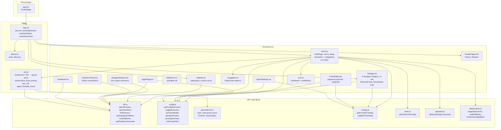
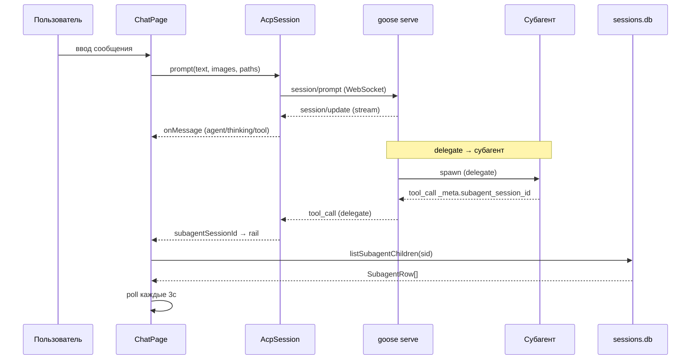
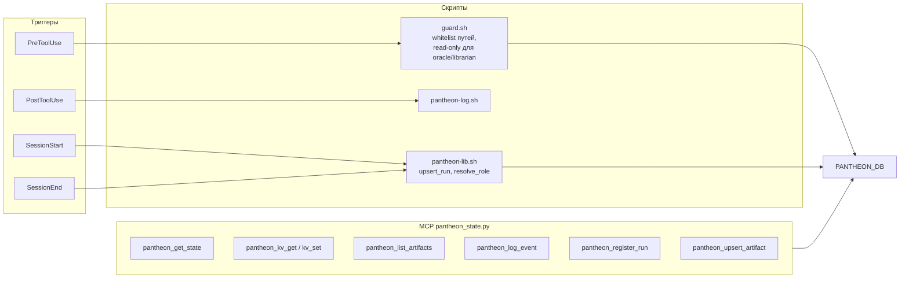
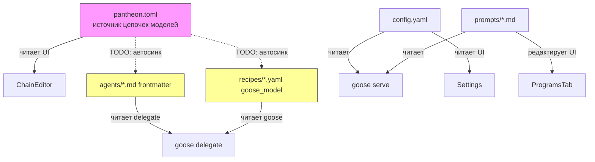
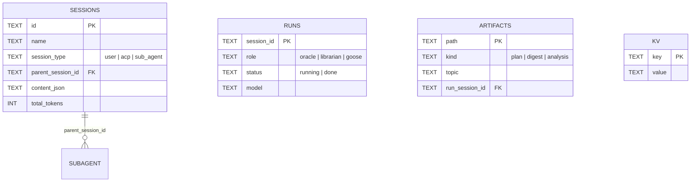

# Архитектура «Маяк» — карта-граф

> Сгенерировано по данным Infigraph 3.2.16 (2347 символа, 104 файла, 340 call-edges).
> Репозиторий: `~/pantheon`, ветка `mayak-gpuix`.

---

## 1. Обзор: три слоя

```mermaid
graph TB
    subgraph L0["Phase 0 — Личности (config-only)"]
        ORACLE["oracle.md<br/>oracle-consult.yaml"]
        LIBRARIAN["librarian.md<br/>librarian-research.yaml"]
        CONDUCTOR["pantheon-conductor.md<br/>(промпт-кондуктор)"]
    end

    subgraph L1["Phase 1 — Плагин контроля"]
        HOOKS["hooks.json<br/>SessionStart / PreToolUse /<br/>PostToolUse / SessionEnd"]
        GUARD["guard.sh<br/>read-only enforcement"]
        LOG["pantheon-log.sh"]
        LIB["pantheon-lib.sh<br/>upsert_run, resolve_role"]
        MCP["pantheon_state.py<br/>7 MCP-инструментов"]
    end

    subgraph L2["Phase 2–4 — UI клиент"]
        MAYAK["mayak-ui (GPUIX)<br/>активный стек"]
        LEGACY["pantheon-ui (Tauri)<br/>legacy, reference"]
    end

    subgraph DATA[("Данные")]
        SESSIONS_DB[("sessions.db<br/>goose сессии")]
        PANTHEON_DB[("pantheon.db<br/>runs / artifacts / kv")]
        CONFIG["config.yaml"]
        TOML["pantheon.toml<br/>цепочки моделей"]
        RECIPES["recipes/*.yaml"]
        PROMPTS["prompts/*.md"]
    end

    subgraph EXT["Внешние сервисы"]
        GOOSE["goose serve<br/>ACP / WebSocket"]
        OPENCODE["OpenCode Go API<br/>/v1/usage, /v1/models"]
    end

    MAYAK --> GOOSE
    MAYAK --> DATA
    LEGACY --> GOOSE
    LEGACY --> DATA
    L1 --> PANTHEON_DB
    L1 --> SESSIONS_DB
    L0 --> RECIPES
    GOOSE --> SESSIONS_DB
    GOOSE --> CONFIG
    MCP --> PANTHEON_DB
    GUARD --> PANTHEON_DB
    LIB --> PANTHEON_DB
```

---

## 2. mayak-ui — внутренняя структура (активный стек)



---

## 3. Потоки данных



---

## 4. Plugin-слой (Phase 1)



---

## 5. Слои конфигурации (кто кого читает)



---

## 6. Языки и размер (Infigraph)

| Язык | Файлов | Символов |
|------|--------|----------|
| tsx | 41 | 684 |
| typescript | 21 | — |
| json | 12 | 55 |
| rust | 7 | — |
| markdown | 6 | 41 |
| bash | 5 | 45 |
| yaml | 4 | 541 |
| sql | 2 | 6 |
| python | 1 | 15 |

**Hub-функции (наибольший fan-in):**
1. `getConfigSummary` — 8 callers
2. `db()` (MCP) — 7
3. `config_path` (Rust) — 7
4. `openPantheon` — 6
5. `configPath` / `readCfg` — 5

**Горячие файлы (по символам):**
1. `Chat.tsx` (mayak-ui) — 71
2. `api/db.ts` — 70
3. `acp.ts` — 64
4. `api/config.ts` — 61
5. `ChainEditor.tsx` — 55

---

## 7. Схема данных (SQL)



---

## 8. Принцип работы (кратко)

1. **Запуск:** `app.tsx` → GPUIX render → `App.tsx` монтирует роутер.
2. **Чат:** `ChatPage` автоконнектится через `AcpSession.start()` → spawn `goose serve` (reuse живого) → WS handshake с `--allowed-origin`.
3. **Сообщения:** `prompt()` → `session/prompt` → stream `session/update` → `onMessage` → React state → markdown рендер.
4. **Субагенты:** `tool_call` с `_meta.subagent_session_id` → rail poll `listSubagentChildren(sid)` каждые 3с.
5. **Вложения:** Ctrl+V / drop / file picker → `stageAttachment` → путь в тексте или image-блок ACP.
6. **Конфиги:** Settings/ChainEditor пишут `config.yaml` / `pantheon.toml` через `api/config.ts` (с бэкапом).
7. **Plugin:** hooks ловят сессии → `guard.sh` проверяет read-only → `pantheon_state.py` пишет в `pantheon.db`.

---

## 9. Известные долги (из графа и плана)

| # | Проблема | Где видно |
|---|----------|-----------|
| 1 | `saveAgentChain` не синкает frontmatter + recipes | config.ts → TOML пишется, md/yaml — нет |
| 2 | 37 сирот `parent_session_id=NULL` | sessions.db, listSubagentChildren не находит |
| 3 | file-deps не резолвит импорты (SCIP enrichment в фоне) | infigraph file-deps = 0 |
| 4 | `ui/pantheon-ui` (Tauri legacy) дублирует mayak-ui | два UI-стека в одном репо |

---

*Сгенерировано: 2026-09-29 · Инструмент: Infigraph 3.2.16 + ручной анализ*
