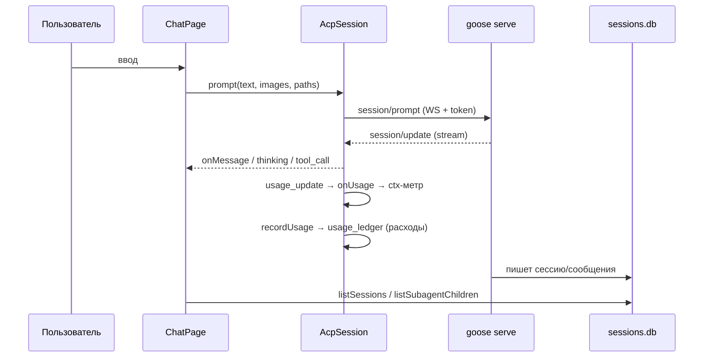
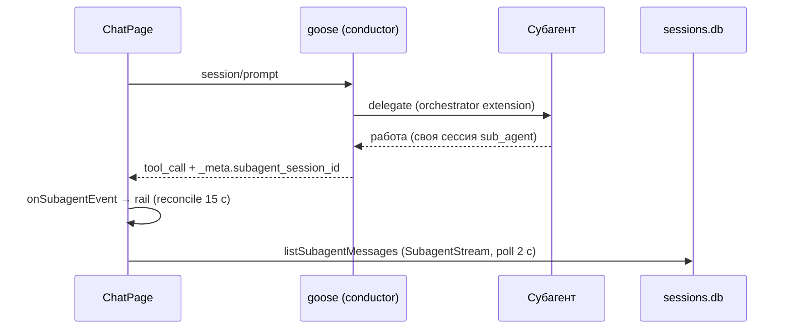
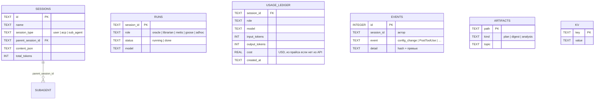

# Архитектура «Маяк» (RU)

> Полная карта-граф (mermaid, Infigraph): [architecture.md](architecture.md) — этот документ дополняет её текстовым описанием слоёв, потоков и подсистем: state machine, guard, watchdog, логирование.
> См. также: [README.md](README.md) · [development.ru.md](development.ru.md) · [../AGENTS.md](../AGENTS.md).

**English version:** [architecture.en.md](architecture.en.md)

---

## 1. Три слоя

```mermaid
graph TB
    subgraph L0["L0 — Личности (config-only)"]
        ORACLE["oracle.md + oracle-consult.yaml"]
        LIBRARIAN["librarian.md + librarian-research.yaml"]
        METIS["pantheon-metis.md + metis-critique.yaml"]
        CONDUCTOR["pantheon-conductor.md<br/>(промпт-кондуктор)"]
    end
    subgraph L1["L1 — Плагин контроля"]
        HOOKS["hooks.json<br/>SessionStart / PreToolUse /<br/>UserPromptSubmit / PostToolUse / SessionEnd"]
        GUARD["guard-rs (pantheon-guard)<br/>read-only enforcement"]
        ESC["escalate.sh<br/>[ESCALATION:LEVEL]"]
        LOG["pantheon-log.sh<br/>runs / events / audit"]
        MCP["pantheon_state.py<br/>7 MCP-инструментов"]
    end
    subgraph L2["L2 — UI (mayak-ui, GPUIX)"]
        APP["App.tsx → Chat / Sidebar / Settings /<br/>PantheonPanel / SubagentStream …"]
        ACP["acp.ts<br/>AcpSession: state machine,<br/>permission policy, watchdog"]
        GSRV["api/gooseServer.ts<br/>spawn goose serve"]
    end
    subgraph EXT["Внешнее"]
        GOOSE["goose serve (sidecar,<br/>ACP / WebSocket)"]
    end
    subgraph DATA[("Данные")]
        SDB[("sessions.db")]
        PDB[("pantheon.db<br/>runs/artifacts/kv/events/<br/>usage_ledger/handoffs")]
        TOML["pantheon.toml"]
        CFG["config.yaml"]
        ART[".pantheon/*.md"]
    end

    APP --> ACP --> GOOSE
    ACP --> GSRV
    GOOSE --> SDB
    L0 -->|delegate| GOOSE
    HOOKS --> GUARD --> PDB
    HOOKS --> ESC
    HOOKS --> LOG --> PDB
    MCP --> PDB
    GOOSE --> CFG
    APP --> PDB
    APP --> TOML
    GOOSE --> ART
```

| Слой | Содержит | Тип изменений |
|---|---|---|
| **L0 — Личности** | `agents/*.md` (oracle, librarian, metis, conductor) + `recipes/*.yaml` (цепочки моделей, max_turns 1000) | config-only |
| **L1 — Плагин** | `plugin/hooks/hooks.json`, `plugin/guard-rs/` (Rust), `plugin/scripts/` (bash), `plugin/mcp/pantheon_state.py` | Rust / bash / Python |
| **L2 — UI** | `ui/mayak-ui/` — GPUIX (React 19 поверх GPUI, без webview), Bun-рантайм, API-слой на `bun:sqlite`/`node:fs` | TypeScript / TSX |

Сторонний legacy-клиент `ui/pantheon-ui-tauri-legacy/` — **архив**, в архитектуре не участвует.

---

## 2. Потоки данных

### 2.1 Основной чат



1. UI спавнит sidecar: `gooseServer.start()` → `goose serve --allowed-origin … --enable-scheduler`, секрет в query `token`, readiness `/status` (25 с), stderr → `goose-serve.log`.
2. `AcpSession.start()` → ACP `initialize` → `session/new` (cwd, mcpServers) → ready → streaming.
3. Ответы goose — `session/update`: `agent_message_chunk`, `agent_thought_chunk`, `tool_call`/`tool_call_update`, `usage_update`, `plan`… (обрабатываемые типы — в [goose-152-compat.md](goose-152-compat.md) §A).

### 2.2 Субагенты



- Делегирование выполняет **goose orchestrator** (`delegate`), не UI; UI только наблюдает.
- Изображения субагентам: реестр `sessionImagePaths` → `[imgs]`-блок в промпте + автоконтекст `session/prompt` к субагенту (паритет отсутствующей в goose передачи картинок через delegate).
- Иерархия: `sessions.db.parent_session_id` + `session_type='sub_agent'` (`listSubagentChildren`).

### 2.3 Конфиги: слои и приоритет

| Файл | Кто пишет | Кто читает |
|---|---|---|
| `pantheon.toml` | ChainEditor → `saveAgentChain` (автосинк) | UI (цепочки) |
| `agents/*.md` frontmatter | автосинк из `saveAgentChain` | goose delegate (**приоритет** над override) |
| `recipes/*.yaml` | автосинк из `saveAgentChain` | goose delegate (**приоритет** над override) |
| `config.yaml` | Settings (toggle, режим, активная модель; бэкапы) | goose serve, UI |
| `prompts/*.md` | ProgramsTab (whitelist, бэкап `.bak`) | goose |

Правило: смена модели одновременно в **трёх** местах (`pantheon.toml` + frontmatter + recipe) — выполняется только через `saveAgentChain`. Источник приоритета: recipe/frontmatter > delegate `model:` override > `pantheon.toml` (UI-документация).

---

## 3. State machine сессии (P16)

`ui/mayak-ui/src/acp.ts`:

```
idle → connecting → ready → streaming → closed
                ↘ error ↗  (reconnect → connecting)
```

| Состояние | Значение |
|---|---|
| `idle` | сессии нет |
| `connecting` | spawn/инициализация sidecar + `initialize`/`session/new` |
| `ready` | подключено, можно отправлять |
| `streaming` | идёт поток ответа |
| `error` | ошибка (reconnect/backoff) |
| `closed` | завершено (только новый start оживляет) |

- Допустимые переходы заданы таблицей `VALID_TRANSITIONS`; **недопустимые переходы игнорируются с записью в лог** — состояние не размазывается по обработчикам, новые переходы добавляются только в таблицу.
- Сопутствующие механизмы защиты от гонок: `generation` (stale-start guard), очередь `enqueue()` для `start/load` (watchdog не перекрывает UI), `watchdogTickInFlight`, `serialize()` для spawn/kill в `gooseServer`.

---

## 4. Guard (L1, read-only enforcement)

Точка: **PreToolUse** хук → `guard-run.sh` → `pantheon-guard` (Rust-бинарь; fallback — `guard.sh` на bash, т.е. fail-safe даже без сборки).

```
hook payload (JSON, stdin)
   → resolve_role(session_id)   # runs в pantheon.db → кэш роли
   → tool = developer__write | developer__edit | developer__shell
   → политика:
        goose/adhoc        → allow (без ограничений)
        oracle/metis write → ТОЛЬКО .pantheon/{plans,analysis}/*.md
        librarian write    → ТОЛЬКО .pantheon/digests/*.md
        shell (роли)       → read-only whitelist
   → stdout {"decision":"block","reason":…} либо allow (exit 0, пустой stdout)
```

Ключевые свойства:
- **DENY по умолчанию**: команда вне whitelist → block; сбой guard'а → `on_failure: block` (fail-safe).
- Shell проверяется **посегментно** (пайпы `|`, `;`, `&&`): запрещены редиректы (кроме `>/dev/null`), backtick/`$(…)`, фон `&`, `git push`/мутации, `sqlite3` мутации (только SELECT), `python` записи, `sed -i`.
- Роль из `runs` (SessionStart заполняет из `recipe_json.title`); кэш роли инвалидируется в `upsert_run`.
- Регресс-набор политики: **24/24** (см. [development.ru.md](development.ru.md) §4).
- Лог: `~/.local/state/pantheon/guard.log`.

### Hook-контур целиком

| Хук | Скрипт | Что делает |
|---|---|---|
| `SessionStart` | `pantheon-log.sh` | регистрирует run (session_id → role) |
| `PreToolUse` (write/edit/shell) | `guard-run.sh` → pantheon-guard | блокирует нарушения политики |
| `UserPromptSubmit` | `escalate.sh` | классификация LOW/MED/HIGH/CRIT → тег `[ESCALATION:LEVEL]` |
| `PostToolUse` | `pantheon-log.sh` | аудит события в `events` |
| `SessionEnd` | `pantheon-log.sh` | закрывает run (`status=done`), чистит кэш роли |

MCP-инструменты (`pantheon_state.py`, stdio): `pantheon_get_state`, `pantheon_kv_get/kv_set`, `pantheon_list_artifacts`, `pantheon_log_event`, `pantheon_register_run`, `pantheon_upsert_artifact` — всё в `pantheon.db`.

---

## 5. Watchdog и надёжность (L2)

`AcpSession` (acp.ts):

- **Health-check**: каждые 10 с GET `/status` sidecar'а;
- при сбое — **reconnect с backoff** (до 8 с) и resurrect сессии (`session/load` последнего sid из `chatSession.lastSid`, переживает рестарты процесса через localStorage);
- **Защита от гонок**: `generation`-счётчик (устаревший `start` бросается), `watchdogTickInFlight` (tick'и не перекрываются), очередь операций `enqueue()` (UI-start и watchdog-reconnect не работают одновременно), `serialize()` на spawn/kill в `gooseServer.ts`;
- **Permissions**: `handlePermissionRequest` — log каждого запроса → UI-handler (если подключён) → иначе авто-allow **только** в режиме `auto` → иначе deny (reject_once/cancelled). Никакого молчаливого allow.

---

## 6. Логирование (P12, сквозное)

Единый формат для **TS / Rust / Python / bash**:

```
2026-09-29T21:40:12.345Z | ERROR | acp.ts | 20260929_3 | session/load | sessionId=undefined fallback=loadId
──────────── timestamp ───── | level | module | session_id | event | detail
```

| Правило | Детали |
|---|---|
| Реализация (UI) | `ui/mayak-ui/src/logger.ts` (`log.debug/info/warn/error/fail`) |
| Уровень | env `MAYAK_LOG=debug\|info\|warn\|error` (default `info`) |
| Ротация | `mayak.log` 5 МБ, 3 старых файла |
| Модуль | имя файла без пути; `sid` — активная сессия или `-` |
| Без пустых catch | **запрещён** `catch {}` без `log.*` — иначе точка отказа невидима |
| Ошибки | только `AppError` (`errors.ts`, коды `E.*`) с `userMessage` для UI + detail для лога |
| Где ещё | Rust guard → `guard.log`; sidecar stderr → `goose-serve.log`; goose → `llm_request.*.jsonl` |

Критерий приёмки: **по логу должна найтись точка отказа любой транзакции.**

---

## 7. Данные



- `pantheon.db` — `~/.local/share/goose/pantheon.db`; схема/миграции: `sql/schema.sql`, `sql/migrations/` (runner `sql/migrate.sh` по `PRAGMA user_version`).
- `usage_ledger` заполняется из ACP `usage_update` (`recordUsage`), агрегируется `getRoleUsage(days)` → секция «РАСХОДЫ · 7 ДНЕЙ» Панели.
- Аудит конфигов: `auditConfigChange(actor, what, old, new)` → `events('config_change')` (хеши + превью, значения целиком в БД не пишутся) → «ИСТОРИЯ ПРАВОК».

---

## 8. Модель надёжности (сводно)

| Механизм | Уровень | Гарантия |
|---|---|---|
| State machine + VALID_TRANSITIONS | L2 | предсказуемое состояние сессии |
| Watchdog + backoff + generation/queue | L2 | соединение переживает падения sidecar без зомби и гонок |
| Permission DENY-by-default | L2 | нет молчаливых разрешений |
| guard-rs + `on_failure: block` | L1 | read-only роли физически не могут писать вне `.pantheon/` |
| Fail-safe fallback guard.sh | L1 | политика работает даже без Rust-сборки |
| Сквозное логирование + AppError | все | наблюдаемость любой транзакции |
| Автосинк конфигов (`saveAgentChain`) | L2→L0 | модель в delegate = модель в UI |
| Бэкапы конфигов (`.bak`, `.yaml.bak-mayak`) | L2 | откат любого изменения настроек |

---

*Актуально на 2026-10-01. Карта-граф: [architecture.md](architecture.md) · Полнота фич против goose 1.52: [goose-152-compat.md](goose-152-compat.md)*
